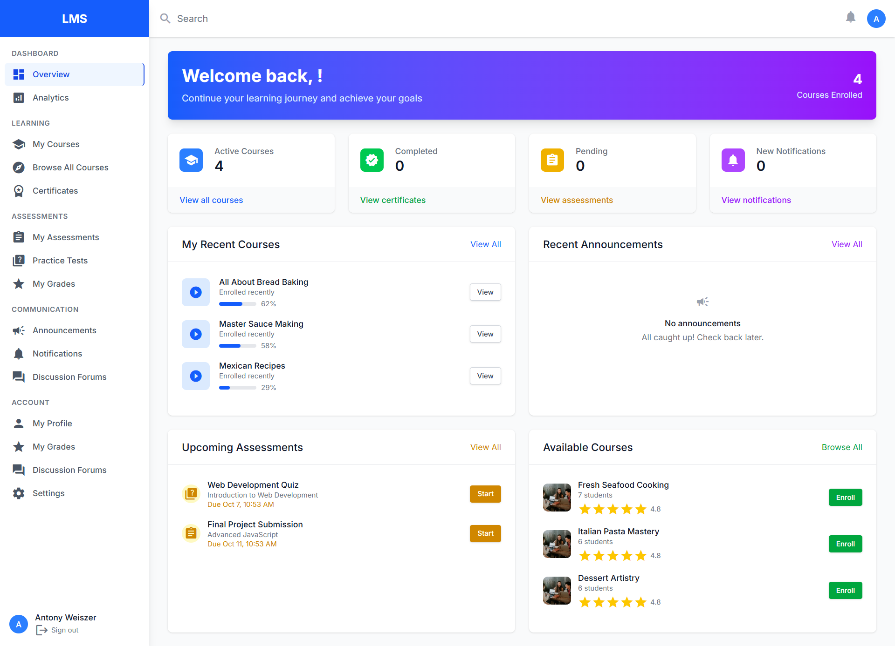
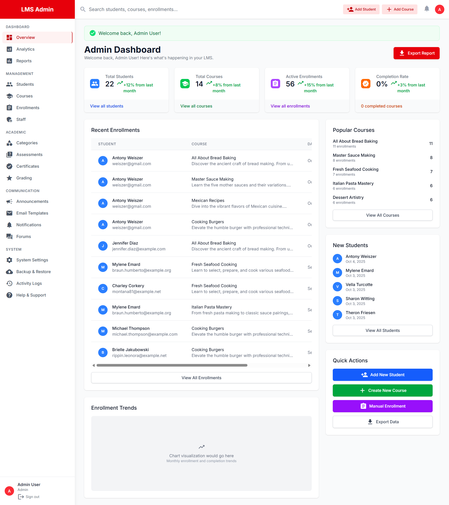

# Learning Management System (LMS)

A comprehensive Learning Management System built with Laravel 12, featuring course enrollment, student management, assessment tools and administrative capabilities. This system demonstrates advanced Laravel concepts including migrations, relationships, API resources, events and comprehensive testing.

## 🎯 System Overview


This LMS implements a complete course enrollment system with the following core entities:
- **Students**: Manage student profiles and enrollments
- **Courses**: Create and manage educational courses  
- **Enrollments**: Handle course registrations with status tracking
- **Assessments**: Quizzes and evaluations
- **Certificates**: Course completion certificates
- **Forums**: Student discussion boards

---
## 🖼️ Screenshots

Below are visual previews of the LMS:

### Home Page


### Student Dashboard


### Admin Dashboard


### A. Migration & Model Implementation 

#### Students Migration
```php
// Migration: 2025_10_03_000001_create_students_table.php
Schema::create('students', function (Blueprint $table) {
    $table->id();
    $table->string('first_name');
    $table->string('last_name');
    $table->string('email')->unique();
    $table->date('date_of_birth');
    $table->string('password');
    $table->rememberToken();
    $table->timestamps();
});
```

#### Student Model with Required Accessor
```php
// app/Models/Student.php
class Student extends Authenticatable
{
    use HasFactory, HasApiTokens;

    protected $fillable = [
        'first_name',
        'last_name',
        'email',
        'date_of_birth',
        'password',
        'role',
        'student_id',
        'bio',
        'notification_preferences',
        'privacy_settings',
    ];

    protected $casts = [
        'date_of_birth' => 'date',
        'password' => 'hashed',
    ];

    protected $hidden = [
        'password',
        'remember_token',
    ];

    /**
     * Accessor for full_name that concatenates first and last names.
     */
    public function getFullNameAttribute(): string
    {
        return $this->first_name . ' ' . $this->last_name;
    }
}
```

### B. Form Request Validation

#### StoreCourseRequest Implementation
```php
// app/Http/Requests/StoreCourseRequest.php
class StoreCourseRequest extends FormRequest
{
    public function authorize(): bool
    {
        return true; // Adjust based on your authorization logic
    }

    public function rules(): array
    {
        return [
            'course_code' => 'required|string|unique:courses,course_code',
            'course_name' => 'required|string|max:255',
            'credits' => 'required|integer|min:1|max:6',
        ];
    }

    public function messages(): array
    {
        return [
            'course_code.unique' => 'This course code is already taken.',
            'credits.min' => 'Credits must be at least 1.',
            'credits.max' => 'Credits cannot exceed 6.',
        ];
    }
}
```

#### Usage in CourseController
```php
// app/Http/Controllers/Admin/CourseController.php
public function store(StoreCourseRequest $request)
{
    $course = Course::create($request->validated());
    
    return redirect()->route('admin.courses.index')
        ->with('success', 'Course created successfully.');
}
```

### C. Blade Component Implementation

**Note**:The current implementation uses direct Blade templates for student cards rather than separate components. Here's how a student card component would be implemented:

#### Student Card Component (Example Implementation)
```php
// app/View/Components/StudentCard.php
class StudentCard extends Component
{
    public $student;

    public function __construct($student)
    {
        $this->student = $student;
    }

    public function render()
    {
        return view('components.student-card');
    }
}
```

#### Component Template
```blade
{{-- resources/views/components/student-card.blade.php --}}
<div class="bg-white rounded-lg shadow-md p-6 border border-gray-200">
    <div class="flex items-center space-x-4">
        <div class="w-12 h-12 bg-blue-500 rounded-full flex items-center justify-center">
            <span class="text-white font-semibold text-lg">
                {{ substr($student->first_name, 0, 1) }}{{ substr($student->last_name, 0, 1) }}
            </span>
        </div>
        <div class="flex-1">
            <h3 class="text-lg font-semibold text-gray-900">
                {{ $student->full_name }}
            </h3>
            <p class="text-sm text-gray-500">
                {{ $student->email }}
            </p>
        </div>
    </div>
</div>
```

#### Usage in Loop
```blade
<div class="grid grid-cols-1 md:grid-cols-2 lg:grid-cols-3 gap-6">
    @foreach($students as $student)
        <x-student-card :student="$student" />
    @endforeach
</div>
```

### D. API Resource & Pagination

#### StudentResource Implementation
```php
// app/Http/Resources/StudentResource.php
class StudentResource extends JsonResource
{
    public function toArray(Request $request): array
    {
        return [
            'id' => $this->id,
            'full_name' => $this->full_name,
            'email' => $this->email,
            'date_of_birth' => $this->date_of_birth->format('Y-m-d'),
            'enrolled_courses' => CourseResource::collection($this->whenLoaded('courses')),
        ];
    }
}
```

#### Controller with Pagination
```php
// app/Http/Controllers/Api/StudentController.php
class StudentController extends Controller
{
    /**
     * Display a listing of students with pagination (10 per page).
     */
    public function index()
    {
        $students = Student::with('courses')->paginate(10);

        return StudentResource::collection($students);
    }

    /**
     * Display the specified student with their enrolled courses.
     */
    public function show($id)
    {
        $student = Student::with('courses')->findOrFail($id);

        return new StudentResource($student);
    }
}
```

---

## - Full Course Enrollment Feature

### Database Schema & Migrations

#### A. Students Table (Already shown above)
```php
// 2025_10_03_000001_create_students_table.php
// Fields: id, first_name, last_name, email (unique), date_of_birth, timestamps
```

#### B. Courses Table  
```php
// Migration: 2025_10_03_000002_create_courses_table.php
Schema::create('courses', function (Blueprint $table) {
    $table->id();
    $table->string('course_code')->unique();
    $table->string('course_name');
    $table->text('description')->nullable();
    $table->integer('credits');
    $table->timestamps();
});
```

#### C. Enrollments Table
```php
// Migration: 2025_10_03_000003_create_enrollments_table.php
Schema::create('enrollments', function (Blueprint $table) {
    $table->id();
    $table->foreignId('student_id')->constrained()->onDelete('cascade');
    $table->foreignId('course_id')->constrained()->onDelete('cascade');
    $table->timestamp('enrolled_on');
    $table->enum('status', ['active', 'completed', 'dropped'])->default('active');
    $table->timestamps();

    // Prevent duplicate enrollments
    $table->unique(['student_id', 'course_id']);
});
```

### Model Relationships

#### Student Model Relationships
```php
class Student extends Authenticatable
{
    /**
     * Relationship: A student can enroll in many courses.
     */
    public function courses()
    {
        return $this->belongsToMany(Course::class, 'enrollments')
            ->withPivot('enrolled_on', 'status')
            ->withTimestamps();
    }

    /**
     * Relationship: A student has many enrollments.
     */
    public function enrollments()
    {
        return $this->hasMany(Enrollment::class);
    }
}
```

#### Course Model Relationships
```php
class Course extends Model
{
    /**
     * Relationship: A course can have many students.
     */
    public function students()
    {
        return $this->belongsToMany(Student::class, 'enrollments')
            ->withPivot('enrolled_on', 'status')
            ->withTimestamps();
    }

    /**
     * Relationship: A course has many enrollments.
     */
    public function enrollments()
    {
        return $this->hasMany(Enrollment::class);
    }

    // Helper accessor for course title
    public function getTitleAttribute()
    {
        return $this->course_name;
    }

    // Currency formatter for Kenyan Shillings
    public function getFormattedPriceAttribute()
    {
        return 'Ksh ' . number_format($this->price, 0);
    }
}
```

### API Endpoints Implementation

#### 1. GET /api/students/{id} → Student with Courses
```php
// Route: routes/api.php
Route::get('/students/{id}', [StudentController::class, 'show']);

// Controller Method (already shown above)
public function show($id)
{
    $student = Student::with('courses')->findOrFail($id);
    return new StudentResource($student);
}
```

#### 2. POST /api/enrollments → Enroll Student in Course
```php
// app/Http/Controllers/Api/EnrollmentController.php
class EnrollmentController extends Controller
{
    public function store(Request $request)
    {
        $data = $request->validate([
            'student_id' => 'required|exists:students,id',
            'course_id' => 'required|exists:courses,id',
        ]);

        // Check if already enrolled before starting transaction
        $exists = Enrollment::where('student_id', $data['student_id'])
            ->where('course_id', $data['course_id'])
            ->exists();
        
        if ($exists) {
            return response()->json(['message' => 'Already enrolled'], 422);
        }

        DB::beginTransaction();
        
        try {
            $enrollment = Enrollment::create([
                'student_id' => $data['student_id'],
                'course_id' => $data['course_id'],
                'enrolled_on' => now(),
                'status' => 'active',
            ]);

            DB::commit();
            
            EnrollmentCreated::dispatch($enrollment);
            
            return response()->json($enrollment, 201);
            
        } catch (\Exception $e) {
            DB::rollBack();
            return response()->json(['error' => 'Enrollment failed'], 500);
        }
    }
}
```

#### 3. GET /api/my-courses → Authenticated Student's Courses
```php
// Route with Sanctum authentication
Route::middleware('auth:sanctum')->get('/my-courses', [StudentController::class, 'myCourses']);

// Controller Method
public function myCourses(Request $request)
{
    $student = $request->user(); // Assumes authenticated student
    $student->load('courses');

    return new StudentResource($student);
}
```

### Testing Implementation

#### Feature Test for Course Enrollment
```php
// tests/Feature/EnrollmentTest.php
class EnrollmentTest extends TestCase
{
    use RefreshDatabase;

    public function test_student_can_enroll_in_course()
    {
        Event::fake();

        $student = Student::factory()->create();
        $course = Course::factory()->create();

        // Create token for student
        $token = $student->createToken('test-token')->plainTextToken;

        $response = $this->withHeaders([
            'Authorization' => 'Bearer ' . $token,
        ])->postJson('/api/enrollments', [
            'student_id' => $student->id,
            'course_id' => $course->id,
        ]);

        $response->assertStatus(201);

        $this->assertDatabaseHas('enrollments', [
            'student_id' => $student->id,
            'course_id' => $course->id,
            'status' => 'active',
        ]);

        Event::assertDispatched(EnrollmentCreated::class);
    }

    public function test_student_cannot_enroll_twice_in_same_course()
    {
        $student = Student::factory()->create();
        $course = Course::factory()->create();

        // Create first enrollment
        Enrollment::factory()->create([
            'student_id' => $student->id,
            'course_id' => $course->id,
            'status' => 'active',
        ]);

        $token = $student->createToken('test-token')->plainTextToken;

        $response = $this->withHeaders([
            'Authorization' => 'Bearer ' . $token,
        ])->postJson('/api/enrollments', [
            'student_id' => $student->id,
            'course_id' => $course->id,
        ]);

        $response->assertStatus(422)
                 ->assertJson(['message' => 'Already enrolled']);
    }
}
```

---

## 🚀 Additional System Features

### Enhanced LMS Capabilities

1. **Assessment System**: Complete quiz and evaluation framework
2. **Certificate Generation**: Automated certificate creation upon course completion  
3. **Forum System**: Student discussion boards with topics and posts
4. **Admin Dashboard**: Comprehensive analytics and management tools
5. **Email Templates**: Customizable notification system
6. **Activity Logging**: Complete audit trail of system activities
7. **Backup & Restore**: Automated system backup capabilities
8. **Multi-currency Support**: Kenyan Shilling (Ksh) pricing throughout

### Authentication & Authorization

- **Multi-guard Authentication**: Separate authentication for students and admins
- **Sanctum API Authentication**: Token-based API security for mobile apps and SPAs
- **Role-based Permissions**: Admin, instructor, and student roles
- **Protected Routes**: Middleware-protected endpoints

### Frontend Features

- **Responsive Design**: Mobile-first approach with Tailwind CSS
- **Course Images**: Dynamic course image display with fallback icons
- **Modern UI**: Clean, professional interface with Material Design icons
- **Interactive Components**: Dynamic forms, modals, and notifications

---

## 🛠️ Installation & Setup

```bash
# Clone repository
git clone [repository-url]
cd LMS

# Install dependencies
composer install
npm install

# Environment setup
cp .env.example .env
php artisan key:generate

# Database setup
php artisan migrate:fresh --seed

# Create admin user
php artisan tinker --execute="App\Models\User::create(['name' => 'Admin User', 'email' => 'admin@example.com', 'password' => bcrypt('password123'), 'role' => 'admin']);"

# Build assets
npm run build

# Serve application
php artisan serve
```

### Login Credentials

#### Admin Access
The system comes with pre-configured admin access:

- **Email**: admin@example.com  
- **Password**: password123
- **Login URL**: `/admin/login`
- **Dashboard URL**: `/admin/dashboard`

#### Creating Additional Admin Users
You can create additional admin users using Laravel Tinker:

```bash
# Create admin user via Tinker
php artisan tinker --execute="App\Models\User::create(['name' => 'Admin User', 'email' => 'admin@example.com', 'password' => bcrypt('password123'), 'role' => 'admin']); echo 'Admin user created successfully!';"

# Or create with custom details
php artisan tinker --execute="App\Models\User::create(['name' => 'Your Name', 'email' => 'your-email@example.com', 'password' => bcrypt('your-password'), 'role' => 'admin']); echo 'Custom admin user created!';"
```

#### Available Admin Accounts
If you've run the database seeder, you may also have these accounts:

- **Email**: admin@lms.test
- **Password**: admin123

#### Student Access  
- Students can register via `/register` or be created through admin panel
- Default student login uses email and password
- Student login URL: `/login`

---

## 📋 Testing

```bash
# Run all tests
php artisan test

# Run specific test suite
php artisan test --testsuite=Feature
php artisan test --testsuite=Unit

# Run with coverage (requires Xdebug)
php artisan test --coverage

# Test specific functionality
php artisan test tests/Feature/EnrollmentTest.php
```

---

## 🔗 API Documentation

### Base URL
```
http://localhost:8000/api
```

### Authentication
Most API endpoints require Sanctum token authentication:
```bash
Authorization: Bearer {token}
```

### Key Endpoints

#### Students
- `GET /api/students` - List students (paginated, 10 per page)
- `GET /api/students/{id}` - Get student with courses
- `GET /api/my-courses` - Get authenticated student's courses

#### Enrollments  
- `POST /api/enrollments` - Enroll student in course
- `GET /api/enrollments` - List all enrollments
- `PUT /api/enrollments/{id}` - Update enrollment status

#### Courses
- `GET /api/courses` - List available courses
- `GET /api/courses/{id}` - Get course details

---

## 🏗️ Architecture Highlights

This LMS demonstrates advanced Laravel patterns:

- **Service Layer Architecture**: Clean separation of concerns
- **Event-Driven Architecture**: Decoupled system components  
- **Transaction Management**: Database consistency with rollback safety
- **Resource Transformations**: Consistent API responses
- **Form Request Validation**: Centralized validation logic
- **Factory & Seeding**: Comprehensive test data generation
- **API Resource Collections**: Proper JSON:API formatting
- **Sanctum Authentication**: Modern token-based security
